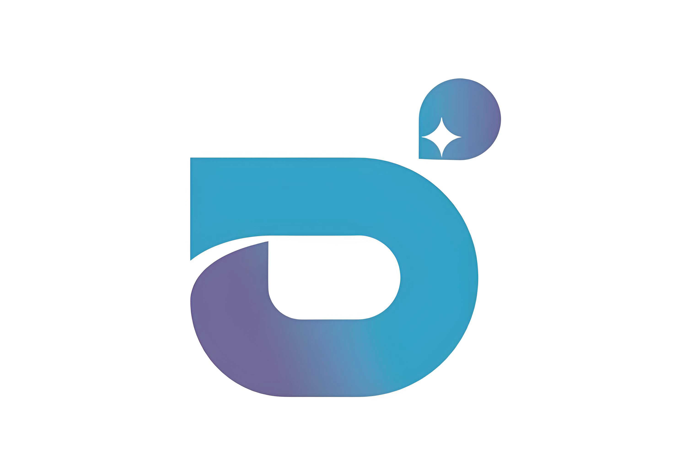
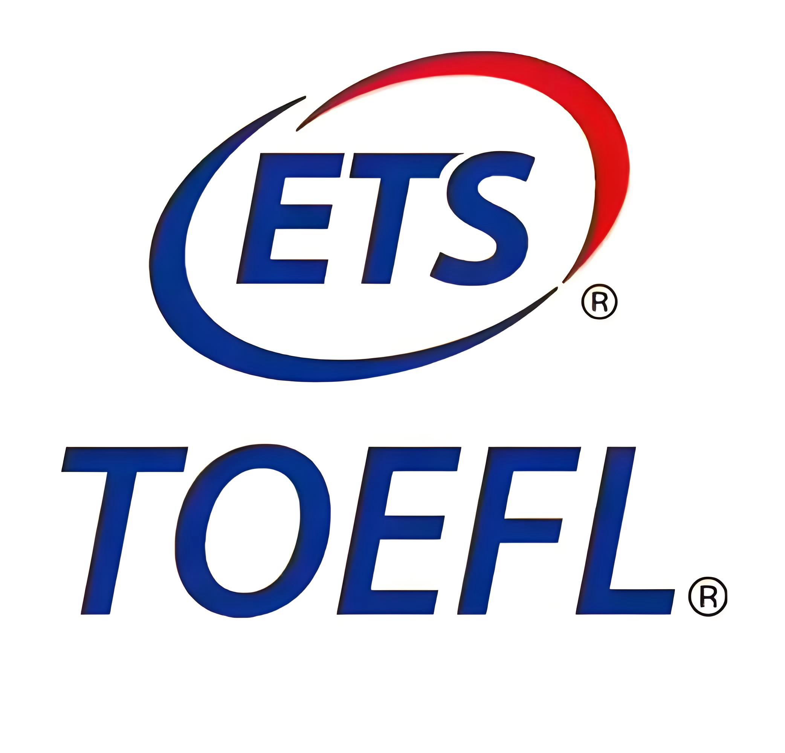

<table style="width:100%;max-width:800px;border:0px;border-spacing:0px;border-collapse:separate;margin-right:auto;margin-left:auto;"><tbody>
  <tr style="padding:0px">
    <td style="padding:0px">
      
      <!-- Bio Section -->
      <table style="width:100%;border:0px;border-spacing:0px;border-collapse:separate;margin-right:auto;margin-left:auto;"><tbody>
        <tr style="padding:0px">
          <td style="padding:2.5%;width:63%;vertical-align:middle">
            

              Haolin Yang 杨昊霖
            

            

              I am a third-year undergraduate student at <a href="https://www.pku.edu.cn/">Peking University</a>, majoring in <strong>Intelligence Science and Technology</strong> at the School of Intelligence Science and Technology.
            

            

              My research focuses on <strong>Embodied Intelligence</strong> and <strong>Multimodal Comprehension</strong>. I am particularly interested in Vision-Language Navigation, Spatial Intelligence, and Multimodal Learning.
            

            

              <a href="mailto:harley_yang@stu.pku.edu.cn">Email</a> &nbsp;/&nbsp;
              <a href="https://github.com/tidalharley">GitHub</a> &nbsp;/&nbsp;
              <a href="https://scholar.google.com/citations?user=qHD7JVAAAAAJ&hl=zh-CN">Google Scholar</a> &nbsp;/&nbsp;
              <a href="https://tidalharley.github.io/PKU-course-notes/index.html">Course Notes</a>
            

          </td>
          <td style="padding:2.5%;width:37%;max-width:37%">
            
          </td>
        </tr>
      </tbody></table>
      
      <!-- Research Interests -->
      <table style="width:100%;border:0px;border-spacing:0px;border-collapse:separate;margin-right:auto;margin-left:auto;"><tbody>
        <tr>
          <td style="padding:16px;width:100%;vertical-align:middle">
            <h2>Research Interests</h2>
            

              Embodied AI
              Vision-Language Navigation
              Spatial Intelligence
              Multimodal Learning
            

          </td>
        </tr>
      </tbody></table>

      <!-- Featured Research -->
      <table style="width:100%;border:0px;border-spacing:0px;border-collapse:separate;margin-right:auto;margin-left:auto;"><tbody>
        <tr>
          <td style="padding:16px;width:100%;vertical-align:middle">
            <h2>Research</h2>
          </td>
        </tr>
      </tbody></table>
      
      <table style="width:100%;border:0px;border-spacing:0px 10px;border-collapse:separate;margin-right:auto;margin-left:auto;"><tbody>
        <tr bgcolor="#ffffd0">
          <td style="padding:16px;width:20%;vertical-align:middle">
            

              
            

          </td>
          <td style="padding:8px;width:80%;vertical-align:middle">
            <a href="https://arxiv.org/abs/2510.08173">
              NavSpace: How Navigation Agents Follow Spatial Intelligent Instructions
            </a>
             
            <em>Preprint · Submitted to ICRA 2026</em>
             
            <a href="https://arxiv.org/abs/2510.08173">arXiv</a>
            

            

              We introduce the <strong>NavSpace</strong> benchmark with six task categories and 1,228 trajectory-instruction pairs to evaluate spatial intelligence in navigation agents. We comprehensively evaluate 22 agents and propose <strong>SNav</strong>, a spatially intelligent navigation model that outperforms existing approaches.
            

          </td>
        </tr>
      </tbody></table>

      <!-- Experience -->
      <table style="width:100%;border:0px;border-spacing:0px;border-collapse:separate;margin-right:auto;margin-left:auto;"><tbody>
        <tr>
          <td style="padding:16px;width:100%;vertical-align:middle">
            <h2>Experience</h2>
          </td>
        </tr>
      </tbody></table>
      
      <table style="width:100%;border:0px;border-spacing:0px 10px;border-collapse:separate;margin-right:auto;margin-left:auto;"><tbody>
        <tr>
          <td style="padding:16px;vertical-align:middle">
            
            <strong>Zhiyuan Robotics Co., Ltd.</strong>
             
            Research Intern · PKU Joint Laboratory
          </td>
        </tr>
        <tr>
          <td style="padding:16px;vertical-align:middle">
            
            <strong>Beijing Zhipu Huazhang Technology</strong>
             
            AI Application Engineer
          </td>
        </tr>
      </tbody></table>

      <!-- Honors & Awards -->
      <table style="width:100%;border:0px;border-spacing:0px;border-collapse:separate;margin-right:auto;margin-left:auto;"><tbody>
        <tr>
          <td style="padding:16px;width:100%;vertical-align:middle">
            <h2>Honors & Awards</h2>
            

              2024-25 Huawei Scholarship 
              2024-25 Peking University Excellent Research Award 
              2023-24 Shenzhen Stock Exchange Scholarship 
              2023-24 Peking University Excellent Research Award
            

          </td>
        </tr>
      </tbody></table>

      <!-- Language -->
      <table style="width:100%;border:0px;border-spacing:0px;border-collapse:separate;margin-right:auto;margin-left:auto;"><tbody>
        <tr>
          <td style="padding:16px;width:100%;vertical-align:middle">
            <h2>Language</h2>
            

              
              <strong>TOEFL iBT:</strong> 114
              Reading30
              Listening30
              Speaking27
              Writing27
            

          </td>
        </tr>
      </tbody></table>

      <!-- Quote -->
      <table style="width:100%;border:0px;border-spacing:0px;border-collapse:separate;margin-right:auto;margin-left:auto;"><tbody>
        <tr>
          <td style="padding:16px;width:100%;vertical-align:middle">
        <blockquote>
            
Man is only a reed, the weakest in nature, but he is a thinking reed.

              
<strong>"All our dignity consists, then, in thought."</strong>

              <cite>— Blaise Pascal, <em>Pensées</em></cite>
        </blockquote>
          </td>
        </tr>
      </tbody></table>

      <!-- Footer -->
      <table style="width:100%;border:0px;border-spacing:0px;border-collapse:separate;margin-right:auto;margin-left:auto;"><tbody>
        <tr>
          <td style="padding:16px;text-align:center;">
            

              © 2025 Haolin Yang · Peking University
               
              Website template from <a href="https://jonbarron.github.io/">Jon Barron</a>
            

          </td>
        </tr>
      </tbody></table>

    </td>
  </tr>
</tbody></table>
